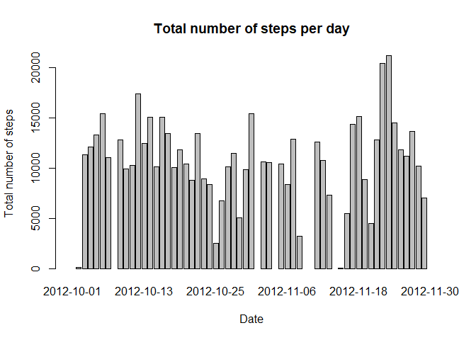
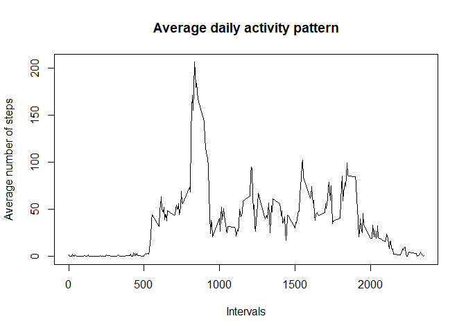
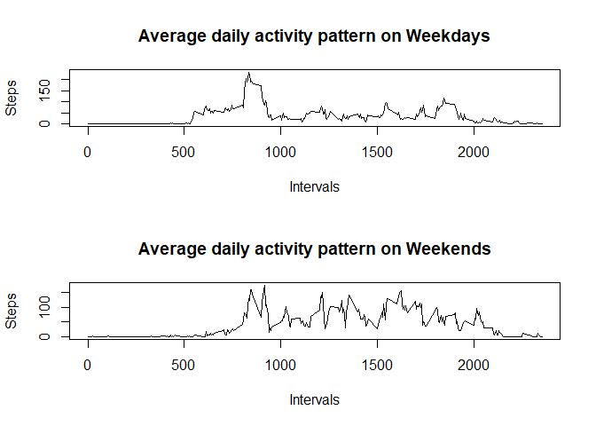

## Loading the necessary libraries: 
# 


```r
library(datasets)
library(ggplot2)
```

## Loading and preprocessing the data
# 


```r
if(!file.exists('activity.csv')){
    unzip('activity.zip')
}
rowdata <- read.csv('activity.csv')
```

## What is mean total number of steps taken per day?


```r
StepsperDay <- aggregate(rowdata$steps, by=list(date=rowdata$date), sum)

barplot(
    StepsperDay$x,
    names.arg = StepsperDay$date,
    xlab = 'Date',
    ylab = 'Total number of steps',
    main = 'Total number of steps per day'
    )
```

<!-- -->

## What is the average daily activity pattern?


```r
avgStepsbyInterval <- aggregate(steps ~ interval, rowdata, mean)

plot(
    avgStepsbyInterval$interval,
    avgStepsbyInterval$steps,
    type = 'l',
    xlab = 'Intervals',
    ylab = 'Average number of steps',
    main = 'Average daily activity pattern')
```

<!-- -->

## Imputing missing values


```r
Missing <- sum(is.na(rowdata))

paste('Total number of missing values in this database is', Missing)
```

```
## [1] "Total number of missing values in this database is 2304"
```

## Are there differences in activity patterns between weekdays and weekends?

Creating a new factor variable showing whether data is from weekdays or weekends:


```r
dtype <- function(date){
  day <- as.POSIXlt(as.Date(date))$wday
  return( ifelse(day == 0 || day == 6, 'Weekend', 'Weekday') )
}

rowdata$dayType <- as.factor(sapply(rowdata$date,dtype))
head(rowdata)
```

```
##   steps       date interval dayType
## 1    NA 2012-10-01        0 Weekday
## 2    NA 2012-10-01        5 Weekday
## 3    NA 2012-10-01       10 Weekday
## 4    NA 2012-10-01       15 Weekday
## 5    NA 2012-10-01       20 Weekday
## 6    NA 2012-10-01       25 Weekday
```

Make a panel plot


```r
par(mfrow=c(2, 1))

#Weekday
avgStepsbyIntervalWeekday <- aggregate(steps ~ interval, rowdata, subset = (rowdata$dayType == 'Weekday'), mean)
plot(
    avgStepsbyIntervalWeekday$interval,
    avgStepsbyIntervalWeekday$steps,
    type = 'l',
    xlab = 'Intervals',
    ylab = 'Steps',
    main = 'Average daily activity pattern on Weekdays')

#Weekend
avgStepsbyIntervalWeekend <- aggregate(steps ~ interval, rowdata, subset = (rowdata$dayType == 'Weekend'), mean)
plot(
    avgStepsbyIntervalWeekend$interval,
    avgStepsbyIntervalWeekend$steps,
    type = 'l',
    xlab = 'Intervals',
    ylab = 'Steps',
    main = 'Average daily activity pattern on Weekends')
```

<!-- -->
